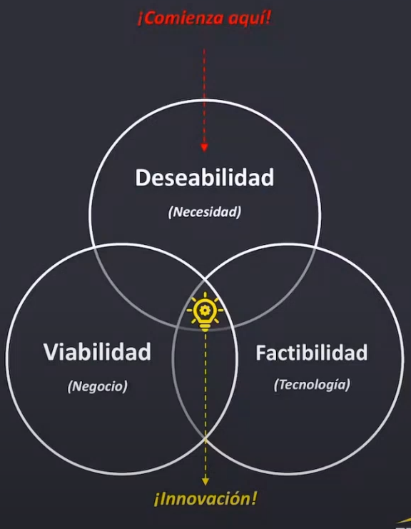
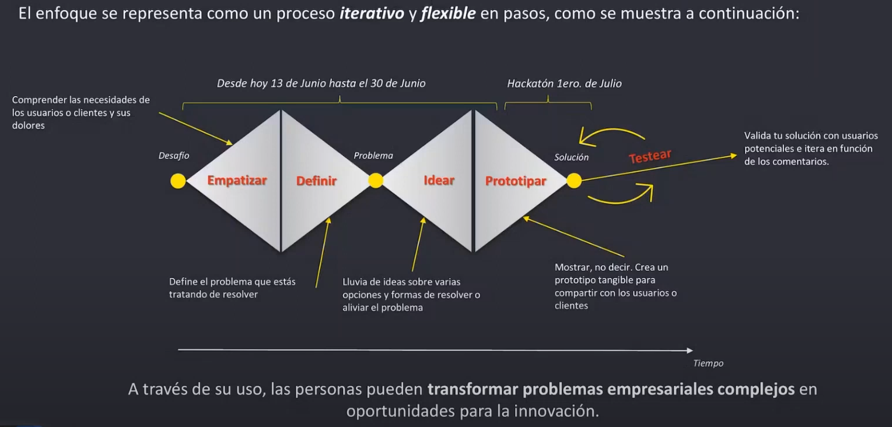

# Metodología Design-Thinking

## Introducción
---

El Design Thinking, o Pensamiento de Diseño, es un enfoque creativo y colaborativo utilizado para resolver problemas y desarrollar soluciones innovadoras. Se basa en la comprensión profunda de las necesidades y deseos de los usuarios, así como en la generación de ideas y la iteración rápida para llegar a soluciones viables y centradas en el usuario.

- **Deseabilidad:** Necesidad, dolor o problema a resolver
- **Viabilidad:** Que sea rentable y pueda ser monetizado o genere un beneficio ‘Ganar-ganar’ para el negocio (Alianzas por ejemplo)
- **Factibilidad:** Contar con las tecnologías y herramientas necesarias para dar solución al problema
- **Innovación:** Lograr combinar los 3 aspectos generados anteriormente, buscando que el producto o servicio a desarrollar perdure en el tiempo, de no serlo, se considera una invención en vez de una innovación.

> *“Debes comenzar con la experiencia del cliente y trabajar hacía la tecnología, no al revés.”* 
**Steve Jobs**
> 

## Fases del Design Thinking
---

El Design Thinking consta de varias fases que guían el proceso de resolución de problemas y desarrollo de soluciones innovadoras. Estas fases son las siguientes:

1. **Empatía:** Comprender profundamente las necesidades, deseos y desafíos de los usuarios a través de la observación, la investigación y la empatía con ellos. Esta fase se centra en obtener la perspectiva clara de los usuarios y sus experiencias.
2. **Definición:** Definir el problema o desafío a abordar partiendo de la comprensión obtenida en la fase de empatía. En esta etapa, se establecen objetivos claros y se crean declaraciones de problema que guiarán el proceso de diseño. Está enmarcado entre la amplitud y lo específico (justo lo suficiente).
3. **Ideación:** Generar una diversidad de ideas y soluciones creativas para abordar el problema definido. Se fomenta el pensamiento divergente y se utilizan técnicas como el pensamiento lateral y el brainstorming para generar ideas innovadoras.
4. **Prototipado:** Construir prototipos rápidos y de bajo costo que representen las soluciones propuestas. Estos prototipos pueden ser tangibles, como maquetas o productos físicos, o intangibles, como maquetas interactivas o simulaciones. Debe permitirte mostrar qué hace, qué soluciona y qué lo hace diferente.
5. **Pruebas:** Probar y evaluar los prototipos con los usuarios para obtener retroalimentación y validar las soluciones propuestas. Esta fase implica iterar y mejorar los prototipos según los comentarios recibidos, con el objetivo de llegar a soluciones viables y centradas en el usuario.

El Design Thinking es un enfoque iterativo, lo que significa que estas fases no son lineales y se pueden repetir según sea necesario para lograr la mejor solución posible.

### Empatizar

La fase de **Empatía** en el Design Thinking es el primer paso crucial en el proceso de resolución de problemas y desarrollo de soluciones innovadoras. Durante esta fase, el objetivo principal es comprender profundamente las necesidades, deseos y desafíos de los usuarios. Esto se logra a través de la observación directa, la investigación y la empatía con los usuarios.

La empatía implica ponerse en los zapatos de los usuarios y comprender sus perspectivas, emociones y experiencias. Se busca obtener una visión clara de cómo los usuarios interactúan con un producto, servicio o sistema existente, y qué problemas o frustraciones enfrentan en su vida diaria. Esto se logra a través de técnicas como la observación directa, las entrevistas, los estudios de campo y la recopilación de datos cualitativos.

Es posible generar empatía con los usuarios a través de:

- Observar a los usuarios interactuando con su entorno
- Involucrar a los usuarios directamente
- Desarrollo de ‘Personas’

> *“Si quieres crear un producto que sea realmente nuevo y diferente, tienes que entender a la gente. Tienes que empatizar con ellos, meterte en sus cabezas y entender realmente sus necesidades y perspectivas”* 
**Tim Brown**
> 

### Definir

La etapa de **Definición** en el Design Thinking se centra en establecer de manera clara el problema o desafío que se va a abordar. Utilizando la comprensión obtenida durante la fase de empatía, se definen objetivos específicos y se crean declaraciones de problema que guiarán el proceso de diseño. En esta etapa, es fundamental tener una visión clara del problema y comprender las necesidades y deseos de los usuarios involucrados. La definición adecuada del problema permite enfocar los esfuerzos de diseño en encontrar soluciones efectivas y centradas en el usuario.

#### Metodología para formular el problema

1. Describir el desafío de manera simple y optimista (Utilizar la pregunta ‘Cómo podríamos?’)
    1. Suficientemente amplio para descubrir áreas de valor inesperadas
    2. Suficientemente estrecho para hacer que el desafío sea manejable
2. Considerar la medida del éxito y la restricción potencial para garantizar que la indagación del éxtio sea viable

> *“Si tuviera una hora para resolver un problema, gastaría los primeros 55 minutos en determinar la pregunta apropiada, porque una vez con la pregunta correcta, podríamos resolver el problema en menos de 5 minutos”* 
**Albert Einstein**
> 

### Idear

La etapa de **Ideación** en el Design Thinking es un proceso creativo y colaborativo en el que se generan una amplia variedad de ideas y soluciones para abordar el problema definido en la etapa anterior. Durante esta fase, se fomenta el pensamiento divergente y se busca explorar diferentes perspectivas y enfoques para encontrar soluciones innovadoras.

Para estimular la generación de ideas, se utilizan técnicas como el pensamiento lateral, el brainstorming y el prototipado rápido. Se anima a los miembros del equipo a pensar más allá de las soluciones convencionales y a ser audaces en sus propuestas. El objetivo es generar una gran cantidad de ideas sin juzgar o descartar ninguna en esta etapa inicial.

> *“La mejor forma de tener una buena idea es tener muchas ideas”* 
**Linus Pauling**
> 

#### Métodos comunes de ideación

- **Lluvia de ideas**
    
    Consiste en generar una gran cantidad de ideas sin juzgar ni descartar ninguna en la etapa inicial. Durante una sesión de lluvia de ideas, los participantes comparten libremente todas las ideas que se les ocurran, fomentando la creatividad y el pensamiento divergente. El objetivo es explorar diferentes perspectivas y enfoques para encontrar soluciones innovadoras al problema definido.
    
- **Dumping de cerebros**
    
    En esta técnica, los participantes comparten rápidamente todas las ideas que se les ocurran, sin importar su viabilidad o calidad. El objetivo es generar una gran cantidad de ideas en un corto período de tiempo, fomentando la creatividad y el pensamiento divergente. Al no juzgar ni descartar ninguna idea durante esta fase, se busca explorar diferentes perspectivas y enfoques para encontrar soluciones innovadoras al problema definido.
    
- **Escritura cerebral**
    
    En esta técnica, los miembros del equipo escriben todas las ideas que se les ocurran de forma grupal haciendo uso de tarjetas con el fin de construir soluciones a partir de las ideas de los demás.
    
- **La peor idea posible**
    
    En esta técnica, los miembros del equipo buscan las peores ideas posibles para resolver la problemática, esto con el fin de expandir el horizonte de ideas y abrir la menta a posibilidades y estrategias no convencionales, lo cual propicia y acelera la innovación.
    

#### Reglas de ideación

- Aplazar el juicio
- Fomentar ideas descabelladas
- Construir sobre las ideas de los demás

### Prototipar

La etapa de **Prototipado** en el Design Thinking es crucial para transformar las ideas generadas durante la fase de ideación en soluciones tangibles y concretas. Durante esta etapa, se construyen prototipos rápidos y de bajo costo que representan las soluciones propuestas. Estos prototipos pueden ser tangibles, como maquetas o productos físicos, o intangibles, como maquetas interactivas o simulaciones.

El objetivo principal del prototipado es obtener retroalimentación de los usuarios y validar las soluciones propuestas. Los prototipos permiten a los diseñadores y equipos de trabajo experimentar y probar diferentes ideas, evaluar su viabilidad y realizar mejoras iterativas. Al recibir comentarios de los usuarios, se pueden realizar ajustes y refinamientos en los prototipos para acercarse cada vez más a una solución final viable y centrada en el usuario. El prototipado se basa en la premisa de que es más efectivo aprender a través de la experimentación y la iteración rápida que a través de la planificación y el desarrollo a largo plazo.

#### Principios fundamentales del prototipado

1. **Simplemente comienza a construir**
    
    Si tienes alguna duda sobre lo que estás tratando de lograr, tu mejor opción es simplemente hacer algo.
    
2. **No dediques demasiado tiempo**
    
    La creación de prototipos tiene que ver con la velocidad para llegar al testeo. Cuanto más tiempo pases construyendo el prototipo, más será el apego emocional a la idea.
    
3. **Construye con el usuario en mente**
    
    El objetivo es aprender de las brechas entre las expectativas y las realidades de los usuarios para mejorar las ideas
    

#### Tipos de prototipos

- **Baja fidelidad**
    
    Se utilizan para idear e iterar sobre la marcha con todas las partes interesadas en un proyecto, utilizando materiales físicos comunes o pantallas (Prototipado en papel, Mockups, Wireframes, Modelos físicos, Láminas de ppt o imágenes).
    
- **Alta fidelidad**
    
    Prototipos que se ven y operan más cerca del producto terminado (Prototipado digital, HTML o Adobe DX)
    

> *“No he fallado. Acabo de encontar 10.000 formas en las que no funciona”* 
**Thomas Edison**
> 

### Probar

La etapa de **Probar** en el Design Thinking se enfoca en evaluar y validar los prototipos creados durante la fase de Prototipado. Durante esta etapa, se busca obtener retroalimentación de los usuarios y realizar mejoras iterativas en las soluciones propuestas.

El objetivo principal de la etapa de Probar es asegurarse de que las soluciones propuestas sean viables y estén centradas en el usuario. Para lograrlo, se realizan pruebas con los usuarios para evaluar la usabilidad, funcionalidad y satisfacción de los prototipos. La retroalimentación recibida de los usuarios se utiliza para realizar ajustes y refinamientos en los prototipos, con el objetivo de llegar a una solución final que cumpla con las necesidades y deseos de los usuarios de manera efectiva.

#### Beneficios de las pruebas de usuario

1. **Ahorran tiempo y dinero**
    
    Al detectar errores y problemas desde el principio, te aseguras de que el producto esté libre de errores.
    
2. **Revelan información inesperada**
    
    Ver a los usuarios reales interactuar con una versión temprana del producto resalta problemas que de otro modo no habrías anticipado.
    
3. **Mejoran la satisfacción del usuario**
    
    El pensamiento de diseño se trata de poner al usuario en el centro. Al recopilar comentarios de primera mano de los usuarios, puedes tomar decisiones informadas, mejorando la satisfacción del usuario a largo plazo.
    

#### Metodologías para las pruebas de usuario

- **Entrevistas individuales:** Se llevan a cabo entrevistas uno a uno con los usuarios para obtener información detallada sobre su experiencia y perspectivas. Estas entrevistas permiten profundizar en los pensamientos, sentimientos y comportamientos de los usuarios.
- **Pruebas de usabilidad:** Se realizan pruebas en las que los usuarios interactúan con un prototipo o producto real para evaluar su facilidad de uso, eficiencia y satisfacción. Estas pruebas permiten identificar problemas de usabilidad y realizar mejoras iterativas.
- **Focus groups (grupos de discusión):** Se reúne a un grupo de usuarios para discutir y compartir sus experiencias, opiniones y sugerencias sobre un producto o servicio. Estos grupos proporcionan información cualitativa y permiten obtener diferentes perspectivas.
- **Observación en el lugar de trabajo:** Se observa a los usuarios en su entorno de trabajo o en situaciones reales de uso para comprender cómo interactúan con un producto o servicio. Esta observación directa proporciona información sobre el contexto de uso y los desafíos reales que enfrentan los usuarios.
- **Análisis de métricas y datos:** Se analizan los datos cuantitativos recopilados a través de herramientas de análisis, como la analítica web o la monitorización de uso de aplicaciones. Estos datos permiten identificar patrones de comportamiento y evaluar el rendimiento del producto o servicio.

> *“La única forma de ganar es aprender más rápido que nadie”* 
**Eric Ries**
> 

## Enlaces de Referencia

---

- [Design Thinking - IDEO U](https://www.ideou.com/pages/design-thinking)
- [Design Thinking - Hasso Plattner Institute of Design at Stanford](https://dschool.stanford.edu/resources/design-thinking)
- [Design Thinking - Interaction Design Foundation](https://www.interaction-design.org/literature/topics/design-thinking)
- [Design Thinking Toolkit - IBM](https://www.ibm.com/design/thinking/)