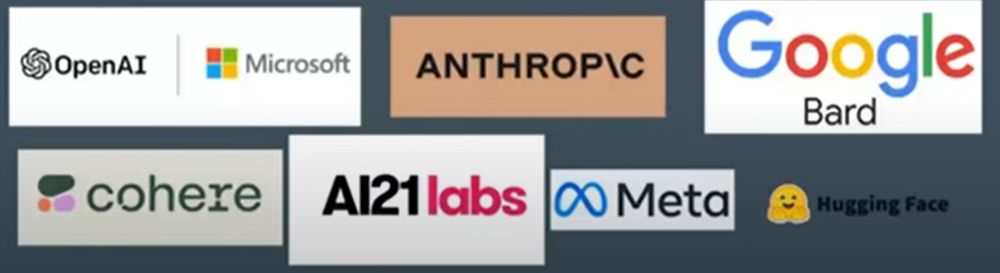

# Framework langChain para LLM

## ¿Qué es Langchain?
---

En un framework en Python que facilita la programación de aplicaciones basadas en LLM. Creado por Harrison Chase.

Este framework es muy fácil de usar para crear aplicaciones con modelos de inteligencia artificial generativa.

Se mantiene actualizado en horas cada vez que hay novedades y siguiendo buenas prácticas.

## Conceptos básicos
---

Estos son los conceptos más generales y básicos para entender Longchain.

### Modelos

Los modelos (langchain.llms) conectan o llaman a langchain para conectar con algún proveedor de inteligencia artificial. Primero crea el proveedor y luego le entrega el modelo al que uno se quiere conectar. 

Algunos proveedores:

<p align=center>

<p>

El principal es microsoft con GPT4, CPT3.5 o Da Vinci. Éste último, no es especializado en chat, sino que se utiliza cuando se necesita procesar un texto y devolver por ejemplo un JSON.

AI21labs y Cohere no tienen modelos de chat, pero con sus framework se pueden crear chats con todas las funciones que tiene, aunque no funcionan igual de bien que los modelos especializados en chat.

> Para que funcione el código hay que hacer un archivo .env con las api key. Por ejemplo, OPENAI_API_KEY con la clave de la página de OpenAI.
> 

#### Ejemplo de llms

Con este código ya se puede hacer un llamado a la API de OpenIA:

```jsx
# Llama las variables de entorno para llamar la API key
from dotenv import load_dotenv
# Importamos la librería de OpenAI desde langchain
from langchain.llms import OpenAI

# Creamos el modelo con temperatura 0.9
llm = OpenAI(temperature=0.9)

# Entregamos la variable text como variable al modelo
text = "Hola cómo estas?"
print(llm(text))
```

La **temperatura** indica que tan random es la respuesta. Un valor bajo siempre va a dar la misma respuesta y un valor alto va a dar respuestas creativas.

En este caso, como no se especifica el **modelo**, por defecto va a tomar Da Vinci.

> DEMO: llm/llm_openai.py
> 

#### Ejemplo con modelos con chat

Ahora cambia un poco el paradigma, ya no hay un texto que entra y otro que sale, es decir, no esta primero la comprensión del lenguaje y luego la generación del lenguaje, sino que tenemos primero **contexto** y **roles** de del sistema, del usuario y asistente o bot.

> DEMO: chat_llm/chat_schema.py
> 

En este caso, en las importanciones se agrega la librería para el esquema, donde llama a los mensajes del humano y del sistema:

```jsx
from dotenv import load_dotenv
from langchain.schema import (
    AIMessage,
    HumanMessage,
    SystemMessage
)
from langchain.chat_models import ChatOpenAI
```

Luego, crea el modelo:

```jsx
chat = ChatOpenAI(model="gpt-3.5-turbo", temperature=0.1)
```

A continuación, el esquema, donde para los roles, cuanto mas ejemplos se den mejor:

```jsx
messages = [
    SystemMessage(content="Eres un experto en la historia del futbol"),
    HumanMessage(content="Quién ganó la copa del mundo de Francia 98?")
]
```

Con `SystemMessage`le estoy danto el **contexto**.

Con `HumanMessage`le estoy haciendo una pregunta al modelo.

Para tener la respuesta se para el mensaje al modelo:

```jsx
response = chat(messages)
```

### Prompt template

Esta es la parte mas importante que tiene langchain porque finalmente, cuando se crea una app, no se necesita solamente que el usuario entregue información y la app le de información de vuelta, sino que necesita rellenar textos con información del usuario. Es necesario crear un buen prompt antes que ese mensaje se envíe al modelo de inteligencia artificial. Por eso, es necesario primero crear un string, una variable, que indique todo lo que uno quiere se se vaya como prompt para obtener una buena respuesta. 

En este template se pueden setear muchas variables como el formato, el idioma, etc. para que dé esa respuesta.

> DEMO: prompt_template/prompt_template.py
> 

Primero se crea el modelo:

```jsx
llm = OpenAI(temperature=0.9)
```

Luego, se crea un template del prompt, donde se pueden enviar un array de variables (`input_variables`) a usar en el `template`, de una manera similar a la que se usa el format string de python.

```jsx
# prompt template con una variables
prompt = PromptTemplate(
    input_variables=["name"],
    template="Hola cómo estás? mi nombre es {name}",
)
```

Se puede ver como se ve el prompt:

```jsx
# entregamos la variable name al prompt
print(prompt.format(name="Fernando"))
```

Finalmente, se puede ejecutar el modelo:

```jsx
# cargamos dentro del modelo el prompt con la variable como parametro
print(llm(prompt.format(name="Fernando")))
```

Entonces, con solo decir el nombre, lo que se le envía al modelo es en realidad la frase: “*Hola cómo estás? mi nombre es Fernando*”.

La respuesta que da el modelo es: “*Hola Fernando, ¡Bienvenido! ¿Cómo puedo ayudarte?*”

En la siguiente demo, se pasan dos variables en el template:

> DEMO: prompt_template/manage_prompt_template.py
> 

```jsx
# En este ejemplo pasamos multiples variables al template
multiple_input_prompt = PromptTemplate(
    input_variables=["time", "name"], 
    template="Hola buenos {time}, mi nombre es {name}."
)

print(multiple_input_prompt.format(time="noches", name="José"))
```

Otra cosa que se puede hacer es llamar a un JSON completo o también yml y pasarlo como variable:

> DEMO: prompt_template/load_promtp.py
> 

```jsx
from langchain.prompts import load_prompt

prompt = load_prompt("./files/simple_prompt.json")
print(prompt.format(name="Daniel", time="tardes"))
```

Donde el formato del archivo JSON es:

> files/simple_prompt.json
> 

```jsx
{
    "_type": "prompt",
    "input_variables": ["name", "time"],
    "template": "Hola {name}, buenas {time}."
}
```

Otras validaciones que se pueden hacer, por ejemplo, cuando tengo dos variables en el template pero sólo le envío una:

> DEMO: prompt_template/prompt_validation.py
> 

```jsx
template = "Mi nombre es {name}."

# desactivamos el error con validate_template = False
prompt_template = PromptTemplate(template=template, 
                                 input_variables=["name", "foo"], 
                                 validate_template=False) # No muestra el error

print(prompt_template.format(name="Daniel"))
```

También se puden crear los templeate teniendo en cuenta los conceptos de:

- **ZeroShot**: cuando sólo se le pasa el texto, sin darle pistas de cómo queremos la respuesta
- **OneShot**: cuando se le pasa un ejemplo de la respuesta que queremos
- **FewShots**: cuando le damos varios ejemplos

> DEMO: prompt_template/prompt_few_shots.py
> 

### Chains

Son cadenas de texto que se pueden ir ejecutando una con otra y se pueden crear muchos prompt templeate y muchas cadenas pero aún así obtener una única respuesta completa específicamente a lo que uno necesita.

Es una herramienta que no sólo sirve para hacer Chat.

Se usa en casos donde le input del usuario es algo difícil de digerir o de programar o de extraer información. De esta forma, con estas herramientas que comprenden muy bien el lenguaje humano se puede manipular la información antes de enviar al modelo.

Esto hace que la consulta (a OpenIA) consuma menos token, lo hace mas barato y mejora la respuesta.

> DEMO: chains/chain.py
> 

Por ejemplo:

Primero se instancia el modelo

```jsx
# cargamos el modelo
llm = OpenAI(temperature=0.9)
```

Luego, se crea el template

```jsx
# creamos el template
prompt = PromptTemplate(
    input_variables=["name"],
    template="Hola cómo estás? mi nombre es {name}",
)
```

Se crea una cadena con los dos puntos anteriores

```jsx
# creamos un chain y le entregamos como parámetro el modelo y el prompt template
chain = LLMChain(llm=llm, prompt=prompt)
```

Se ejecuta la cadena con el parámetro requerido

```jsx
# ejecutamos la cadena con el parametro name = Fernando
print(chain.run("Fernando"))
```

Se pueden crear varias cadenas.

> DEMO: chains/simple_sequential_chains.py
> 

Donde se crea dos respuesta, una para cada cadena. Cada cadena tiene dos templeate y utilizan el misma variable de input.

En cada cadena se puede concatener distintos modelos.

> **Hasta aca lo importante es entender cómo se arma el prompt, cómo se envía y qué devuelve el modelo**
> 

### Embeddings

Son vectores que clasifican el texto, o específicamente el chunk de un texto, en una base de datos vectorial, con los cuales se pueden hacer búsquedas semánticas.

Luego, cuando el usuario hace una consulta, ésta se transforma en embedding, es decir en vector, y ese vector se compara con todos los vectores de la base de datos. De allí se hace un ranking de los vectores que están en la base de datos que más se relaciona semánticamente con la pregunta. 

Una vez encontrados esos vectores, sumado a la pregunta del usuario y mas información de contexto que se puede agregar, se arma el prompt para la consulta al modelo. 

De esta manera la búsqueda semántica funciona muy bien con este tipo de base de datos vectorial.

⚠️ Las base de datos vectoriales no son reutilizables con distintos modelos.

⚠️ Cuando se rankean los embeddings, no quiere decir que las primeras son las mejores, quizás la última también sirve para esa pregunta.

### Agents

Permiten ejecutar cosas que estan fuera del alcance de los modelos de lenguaje. Por fuera se pueden entrenar, entregar información específica, hasta conexión a internet, donde los agentes van a ir, por ejemplo, a internet, van a ejecutar tareas y van a devolver una información que se le va a entregar al modelo.

Para crear agentes especializados, se puede usar la plataforma [judini.ai](http://judini.ai) que tiene una API: [https://judini.gitbook.io/api-judini/](https://judini.gitbook.io/api-judini/) donde permite omitir toda la parte de los embeddings. Se necesita acreditarse para poder usarlo.

## Referencias
---

1. GitHug de creador de Langchain [https://github.com/hwchase17](https://github.com/hwchase17)
2. GitHub de prácticas de este video: [https://github.com/davila7/langchain-101](https://github.com/davila7/langchain-101)
3. Cuenta Huggingface de Daniel Avila [https://huggingface.co/davila7](https://huggingface.co/davila7)